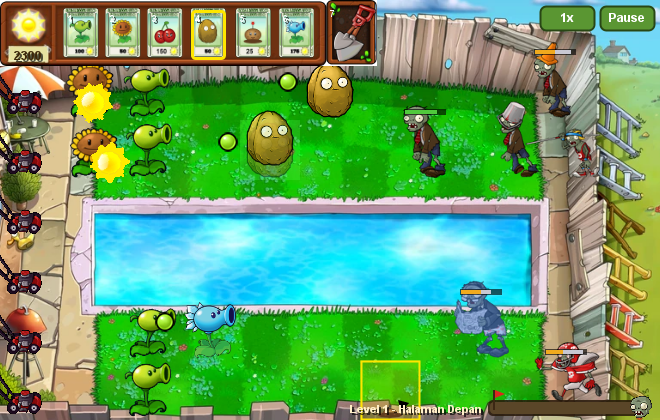
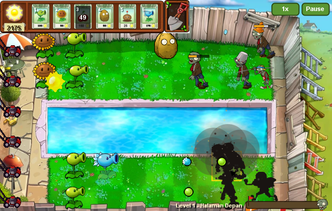
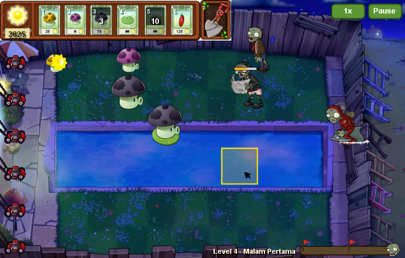
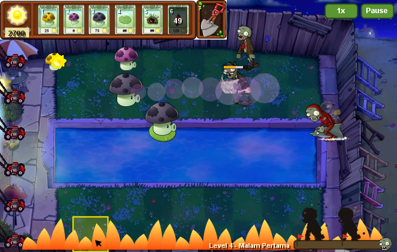
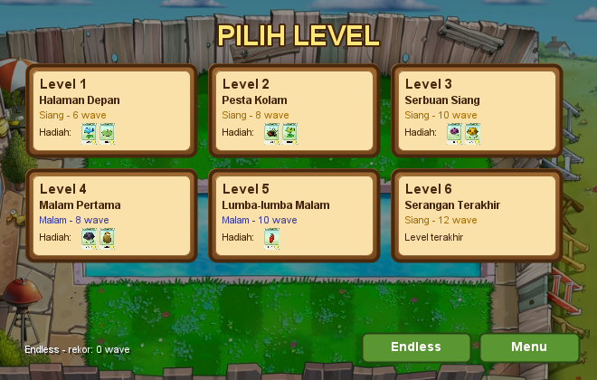
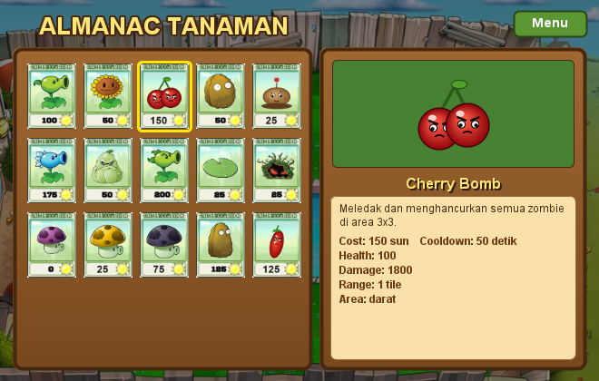

# Plants vs Zombies (Java)

[](https://github.com/rivaldimhr/plants-vs-zombies-java/actions/workflows/build.yml)

Game tower defense bergaya *Plants vs Zombies*, dibuat dengan Java Swing murni (tanpa library game).

Pilih 6 tanaman, tanam di halaman (darat dan kolam), kumpulkan sun, dan tahan gelombang zombie. Jika zombie masuk ke rumah, pemain kalah. Pemain menang jika semua wave berhasil dikalahkan.

| | |
| --- | --- |
|  |  |
|  |  |
|  |  |

## Fitur

- **6 level petualangan + mode Endless.** Level siang dan malam, wave dengan bendera, tulisan *"A huge wave of zombies is approaching!"* dan **FINAL WAVE**, serta progress bar wave.
- **15 tanaman dan 10 zombie** dengan kemampuan masing-masing. Tanaman baru terbuka setiap kali level selesai.
- **Mekanik ala PvZ asli:**
  - sun jatuh dan harus **diklik**;
  - **lawn mower** di setiap baris;
  - zombie dengan **armor** (cone dan ember jatuh saat hancur);
  - jamur yang tidur saat siang.
- **Animasi:**
  - zombie berjalan, makan, dan mati (roboh, gosong karena ledakan, tenggelam, gepeng, terlempar);
  - kilat putih saat terkena serangan;
  - animasi tembakan;
  - ledakan, api, dan partikel.
- **Kontrol lengkap:**
  - mouse dan keyboard;
  - bayangan tanaman sebelum ditanam;
  - drag and drop deck;
  - pause dan kecepatan 2×.
- **Suara dan musik**, dibuat sintetis tanpa aset berhak cipta.
- **Progres tersimpan** otomatis: level selesai, rekor Endless, dan pengaturan.
- **Almanac** tanaman dan zombie yang datanya diambil langsung dari kode.
- **Ukuran jendela** 1×, 1,5×, atau 2×.

## Cara Menjalankan

### Cara termudah: JAR siap main

Download `plants-vs-zombies.jar` dari halaman [Releases](https://github.com/rivaldimhr/plants-vs-zombies-java/releases), lalu:

```
java -jar plants-vs-zombies.jar
```

Butuh **Java 17** atau lebih baru. Di Windows biasanya cukup double-click file JAR.

### Dari source code

Butuh **JDK 17** atau lebih baru (cek dengan `java -version` dan `javac -version`).

```
git clone https://github.com/rivaldimhr/plants-vs-zombies-java.git
cd plants-vs-zombies-java
```

| | Windows | Linux / macOS / Git Bash |
| --- | --- | --- |
| Main | `run.bat` | `./run.sh` |
| Unit test | `test.bat` | `./test.sh` |
| Buat JAR (`dist/`) | `build-jar.bat` | `./build-jar.sh` |

Jalankan dari folder yang berisi `src/`, `image/`, dan `sound/`.

<details>
<summary>Perintah manual (tanpa script)</summary>

**Git Bash / Linux / macOS**
```
javac -encoding UTF-8 -d bin $(find src -name '*.java')
java -cp bin game.Game
```

**Windows CMD**
```
dir /s /b src\*.java > sources.txt
javac -encoding UTF-8 -d bin @sources.txt
java -cp bin game.Game
```

**Windows PowerShell**
```
Get-ChildItem -Recurse src -Filter *.java | ForEach-Object { $_.FullName } | Set-Content sources.txt
javac -encoding UTF-8 -d bin "@sources.txt"
java -cp bin game.Game
```
</details>

<details>
<summary>Dari IDE (IntelliJ IDEA / VS Code)</summary>

- **IntelliJ IDEA**:
  - tandai `src` sebagai *Sources Root* dan `test` sebagai *Test Sources Root*;
  - tambahkan `lib/junit-platform-console-standalone-1.10.2.jar` sebagai library;
  - jalankan `game.Game` dengan *Working directory* = folder project.
- **VS Code** (Extension Pack for Java): klik *Run* di atas `main` pada `src/game/Game.java`.
</details>

### Troubleshooting

| Masalah | Solusi |
| --- | --- |
| Gambar kosong, terminal menampilkan `Aset tidak ditemukan: ...` | Jalankan dari folder project, atau pakai JAR |
| `'javac' is not recognized` | Install JDK 17+ dan tambahkan ke `PATH` |
| Tidak ada suara | Cek *Pengaturan* di menu utama; tanpa perangkat audio, game tetap jalan tanpa suara |
| Ingin mengulang dari awal | *Pengaturan* → *Hapus progres*, atau hapus `~/.pvz-java/save.properties` |

## Cara Bermain

1. **Menu** → *Start* → pilih level. *Pengaturan* ada di pojok kiri atas.
2. **Inventory**: pilih 6 tanaman untuk deck, lalu *Play*.

| Aksi di Inventory | Cara |
| --- | --- |
| Masukkan / keluarkan tanaman | Klik kartu |
| Swap posisi di deck | Klik kartu deck, lalu klik kartu deck lain |
| Ganti kartu deck | Klik kartu deck, lalu klik tanaman di inventory |
| Keluarkan dari deck | Klik kanan kartu deck |
| Drag and drop | Seret kartu ke slot deck, atau seret keluar deck untuk mengeluarkan |

3. **Bermain**

| Aksi | Mouse | Keyboard |
| --- | --- | --- |
| Ambil sun | Klik sun | – |
| Menanam | Klik kartu, lalu klik tile | Panah + Enter pilih tile, lalu 1–6 |
| Mencabut tanaman | Klik sekop, lalu klik tanaman | Pilih tile, lalu 7 |
| Batal memilih | Klik kanan | – |
| Kecepatan 1× / 2× | Tombol *1x* | F |
| Pause | Tombol *Pause* | P / Esc |

Aturan tanam:
- Kolom paling kiri (rumah dan lawn mower) dan paling kanan (tempat zombie muncul) tidak bisa ditanami.
- Baris 3–4 adalah kolam: hanya untuk tanaman air (Lily Pad, Tangle Kelp).
- Tanaman darat bisa ditanam di kolam jika di atas Lily Pad.
- Setiap slot deck punya cooldown setelah dipakai.

## Level

| Level | Nama | Waktu | Wave (bendera) | Zombie baru | Hadiah |
| --- | --- | --- | --- | --- | --- |
| 1 | Halaman Depan | Siang | 6 (6) | Normal, Conehead | Snow Pea, Lily Pad |
| 2 | Pesta Kolam | Siang | 8 (4, 8) | Newspaper, Pole Vaulting, Ducky Tube | Tangle Kelp, Repeater |
| 3 | Serbuan Siang | Siang | 10 (5, 10) | Buckethead, Ducky Tube Conehead, Snorkel | Puff-shroom, Sun-shroom |
| 4 | Malam Pertama | Malam | 8 (4, 8) | – | Fume-shroom, Tall-nut |
| 5 | Lumba-lumba Malam | Malam | 10 (5, 10) | Football, Dolphin Rider | Jalapeno |
| 6 | Serangan Terakhir | Siang | 12 (4, 8, 12) | semua | – |
| ∞ | Endless | Siang | tak terbatas (bendera tiap 10) | semua | rekor wave |

Tanaman awal: Peashooter, Sunflower, Cherry Bomb, Wall-nut, Potato Mine, Squash. Mode Endless terbuka setelah Level 3. Untuk demo, semua level bisa dibuka lewat *Pengaturan → Buka semua level*.

## Aturan Waktu

Game berjalan 60 tick per detik.

| Hal | Nilai |
| --- | --- |
| Wave pertama | Detik 20 (waktu persiapan) |
| Wave berikutnya | Tiap 25 detik, atau lebih cepat kalau zombie wave sebelumnya tinggal < 35% HP |
| Peringatan huge wave | 5 detik sebelum wave bendera |
| Sun awal | 50 |
| Sun dari langit | 25, tiap 7–11 detik, **hanya siang**; hilang setelah 10 detik kalau tidak diambil |
| Kecepatan zombie | ±5,5 px/detik (±11 detik per tile); Football & Pole Vaulting 2×, Dolphin Rider ±2× |
| Diperlambat Snow Pea | Jalan & makan 2× lebih lambat selama 3 detik |

## Tanaman

| Tanaman | Cost | HP | Damage | Serang tiap | Range | Cooldown | Keterangan |
| --- | --- | --- | --- | --- | --- | --- | --- |
| Peashooter | 100 | 100 | 25 | 4 s | 1 baris | 10 s | |
| Sunflower | 50 | 100 | – | – | – | 10 s | Sun 25 tiap 12 detik |
| Cherry Bomb | 150 | 100 | 1800 | – | 3×3 | 50 s | Meledak 1,2 detik setelah ditanam |
| Wall-nut | 50 | 1000 | – | – | – | 20 s | Penahan, retak saat rusak |
| Potato Mine | 25 | 100 | 1800 | – | 1 tile | 30 s | Aktif setelah 14 detik |
| Snow Pea | 175 | 100 | 25 | 4 s | 1 baris | 10 s | Memperlambat zombie |
| Squash | 50 | 100 | 5000 | – | 1 tile | 20 s | Melompat & menghantam |
| Repeater | 200 | 100 | 25 ×2 | 2 s | 1 baris | 10 s | |
| Lily Pad | 25 | 100 | – | – | – | 10 s | Alas di kolam |
| Tangle Kelp | 25 | 100 | 2000 | – | 1 tile | 15 s | Tanaman air, menarik zombie ke air |
| Puff-shroom | 0 | 100 | 15 | 4 s | 3 tile | 7 s | Jamur (tidur saat siang) |
| Sun-shroom | 25 | 100 | – | – | – | 8 s | Jamur; sun 15, jadi 25 setelah 1 menit |
| Fume-shroom | 75 | 100 | 20 | 4 s | 4 tile | 8 s | Jamur; menembus semua zombie |
| Tall-nut | 125 | 2000 | – | – | – | 30 s | Tidak bisa dilompati |
| Jalapeno | 125 | 100 | 1800 | – | 1 baris | 50 s | Membakar satu baris |

## Zombie

Semua zombie menyerang 100 damage tiap 1 detik.

| Zombie | HP (badan + armor) | Area | Kemampuan |
| --- | --- | --- | --- |
| Normal | 125 | Darat | – |
| Conehead | 125 + cone 125 | Darat | Cone jatuh → jadi Normal |
| Pole Vaulting | 175 | Darat | Berlari & melompati tanaman pertama (kecuali Tall-nut) |
| Buckethead | 125 + ember 175 | Darat | Ember jatuh → jadi Normal |
| Newspaper | 100 + koran 100 | Darat | Marah setelah koran hancur: jalan & makan 2× |
| Football | 125 + helm 175 | Darat | Berlari 2× lebih cepat |
| Ducky Tube | 100 | Kolam | – |
| Ducky Tube Conehead | 100 + cone 150 | Kolam | – |
| Snorkel | 100 | Kolam | Menyelam (kebal peluru) sampai muncul untuk makan |
| Dolphin Rider | 175 | Kolam | Tanaman pertama yang ditemui langsung mati |

## Struktur Project

```
src/
  game/                     layar, alur game, dan aturan permainan
    Game                    main class: JFrame + game loop (60 UPS, 120 FPS)
    Board                   state satu permainan (bisa diuji tanpa layar)
    Level, Wave, WaveSpawner  level, isi wave, dan kemunculan wave
    Deck, Sun, SaveData     deck + cooldown, bank sun, progres tersimpan
    GameEvent(Listener), SoundManager  event bus & suara (Observer)
    Assets, Sprite          loader aset (JAR/folder) & animasi sprite sheet
    ScreenMethod, BaseScreen, AlmanacScreen, UI, MyButton, Toast
    Menu, LevelSelect, Inventory, GameLevel, GameOver, Win,
    PlantsList, ZombiesList, Help, Settings
  entity/
    Entity, Updatable, DamageType, SunToken, LawnMower
    plant/        Plant, ShooterPlant, SunProducerPlant, BombPlant, PlantType + 15 tanaman
    zombie/       Zombie, Armor, ZombieType + 10 zombie
    projectile/   Bullet, PeaBullet, SlowBullet, PuffBullet
    effect/       Effect, SpriteEffect, DeathEffect, ParticleEffect, ExplosionEffect,
                  FireRowEffect, FumeEffect, ArmorDropEffect
test/                       116 unit test JUnit 5
image/                      aset gambar asli
image/sprites, cards, ui    aset turunan (dibuat tools/build_assets.py)
sound/                      efek suara & musik (dibuat tools/generate_sounds.py)
tools/                      script pembuat aset (Python)
lib/                        JUnit
.github/workflows/          CI: test + build JAR + release otomatis
```

### Membuat ulang aset

Butuh Python dengan Pillow dan numpy (`pip install pillow numpy`).

```
python tools/build_assets.py     # sprite sheet, kartu, gambar tanaman baru
python tools/generate_sounds.py  # efek suara & musik
```

## Konsep OOP & Design Pattern

- **Inheritance**
  - `Entity` → `Plant` / `Zombie`;
  - `Plant` → `ShooterPlant` / `SunProducerPlant` / `BombPlant` → tanaman konkret;
  - `Effect` → berbagai efek;
  - `BaseScreen` → `AlmanacScreen` → `PlantsList` / `ZombiesList`.
- **Abstraction**: `Entity`, `Plant`, `Zombie`, `Bullet`, `Effect`, dan `BaseScreen` adalah abstract class.
- **Interface**: `Updatable`, `ScreenMethod` (dengan default method), dan `GameEventListener`.
- **Polymorphism**: `Board` meng-update semua tanaman, zombie, dan peluru tanpa tahu jenis konkretnya. Kemampuan khusus dibuat lewat override:
  - `PoleVaultingZombie.update`
  - `SnorkelZombie.isTargetable`
  - `SlowBullet.onHit`
  - `WallNut.getSpriteId`
  - `Zombie.createDeathEffect`
- **Encapsulation**: state permainan dimiliki `Board` (tanpa variabel `static` global). Atribut entity `protected`/`private` dengan getter.
- **Composition**: zombie + `Armor` (cone, ember, koran, helm), bukan satu subclass untuk setiap kombinasi.
- **Design pattern:**
  - *Factory*: `PlantType`, `ZombieType`.
  - *Template Method*: `Plant.update` → `act`, `ShooterPlant.act` → `shoot`, `BombPlant.act` → `detonate`, `BaseScreen.render` → `renderContent`.
  - *Observer*: `Board` → `GameEvent` → `SoundManager`.
  - *State*: `States` + layar aktif di `Game`.
  - *Flyweight / cache*: `Assets` dan `Sprite.scaledTo` / `Sprite.tinted`.

## Asal Project

Project ini berawal dari Tugas Besar kelompok mata kuliah Pemrograman Berorientasi Objek (IF2212) di [rivaldimhr/TUBES-OOP-IF2212](https://github.com/rivaldimhr/TUBES-OOP-IF2212), lalu dilanjutkan sebagai project pribadi.

## Lisensi

Kode sumber memakai lisensi [MIT](LICENSE). Aset gambar *Plants vs Zombies* adalah milik PopCap Games / Electronic Arts dan dipakai untuk keperluan belajar non-komersial; aset tersebut tidak termasuk dalam lisensi. Gambar tanaman baru, efek suara, dan musik dibuat sendiri oleh script di `tools/`.
